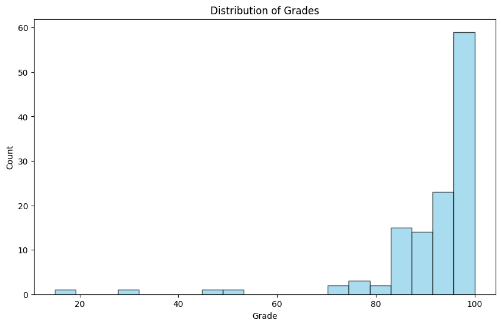
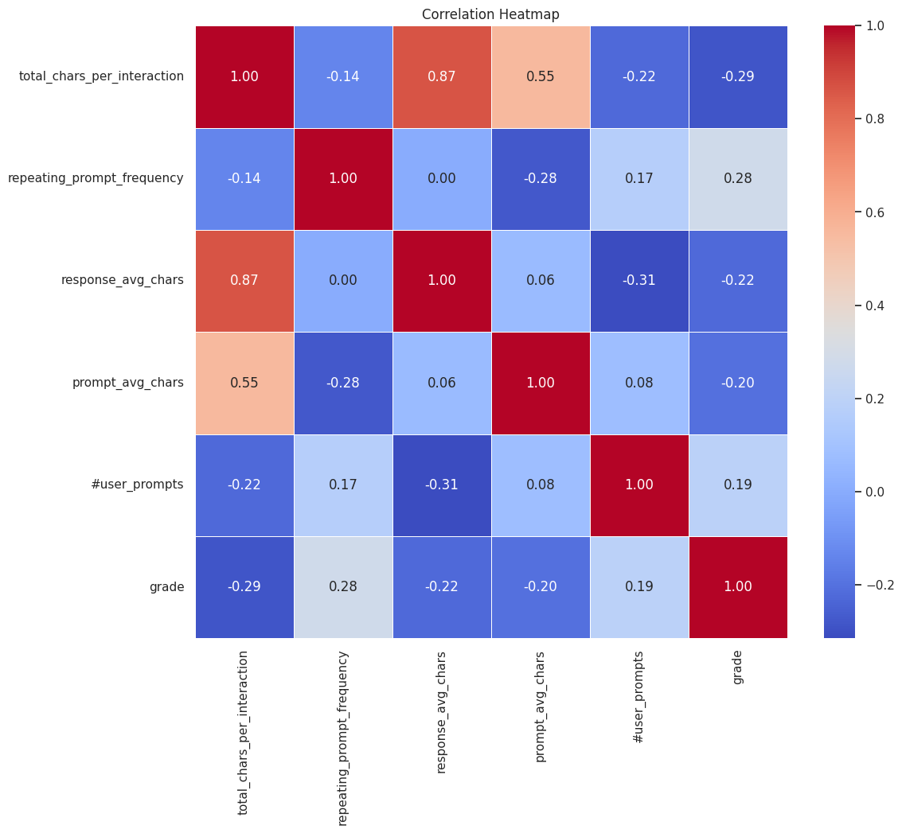

# CS412 Machine Learning Course Project
***
## Project Description

The project aims to predict homework scores using various machine learning models. The approach involves extracting and preprocessing data from conversations, employing feature engineering techniques to enrich the dataset, and then applying multiple regression models to predict the scores. This multidimensional analysis ensures a thorough understanding and effective prediction of homework scores based on the given data.

The work presented is for the CS412 Machine Learning course at Sabanci University.

## Overview of the Repository
1. [Methodology](#methodology)
2. [Results](#results)
3. [Team Contributions](#teamcontributions)

## Methodology
***
A list of methodologies used within the project:

* Data Preparation

The data extracted from HTML files that store the ChatGPT conversations of students. The HTML files are read, parsed with BeautifulSoup and conversations are extracted based on specific patterns. The code is extracted from file path, acting as a key in the “code2convos” dictionary where results are stored. If there are errors, detailed information is recorded in the log file, aiding in debugging and analysis. Duplicated keys are removed to prevent overwriting. 

Texts in the dictionary are preprocessed by several steps, including lowercasing, removal of punctuation and special characters, stopword removal, stemming, and lemmatization. Tokenized words are then rejoined into a single string. The dictionary is updated with the preprocessed version.

Prompts written by students are matched with questions given in the assignment by the simple term frequency vectorizing method. The distances between vectors representing prompts and questions are calculated. Mapping between file codes and their cosine similarity scores for each question is done.

Since we ran multiple training models for the next parts, tokenization and vectorization of data were needed for the ones which require a numerical format as it is a common preprocessing step for natural language processing tasks. 

* Feature Engineering

Many features were created, and some with high correlations were selected for training our models. If we used all these features, our models might have a an overfitting problem. Here is the list of our features created:

1. Number of prompts that a user asked
2. Number of complaints that a user makes (e.g., "the code gives this error!")
3. User prompts average number of characters
4. Total number of prompts
5. Ratio of error prompts to total prompts
6. Average entropy per prompt
7. Total characters per interaction (sum of prompt and response averages)
8. Ratio of prompt characters to response characters
9. Average Q per responses
10. Positive responses to negative responses ratio
11. Response Complexity
12. Response diversity
13. Prompts to errors ratio
14. Frequency of "thank you"
15. Average entropy of responses
16. Q_0 - Q_8 ratio to total prompts
17. Response length
18. Sentiment Analysis on Responses
19. Frequency of repeating prompts
20. Flesch-Kincaid readability score
21. Question number where the student starts consulting GPT
22. Primitive Grade (calculated based on similarity score and max point of each question)

  

The general scores data were skewed, indicating that the histogram was asymmetrically distributed. Many students received very high grades on a scale of 80-100 out of 100. The lowest scores, 15 and 31, were identified as outliers. The features are normalized using MinMaxScaler to scale each numerical value between 0 and 1. The scores merged with the features data frame for further analysis in the next steps. Rows with NaN values and duplicates are disregarded.
  
* Different Models trainings (NN, randomForest etc.)
 ### Decision Tree Regressor:
   * Overview:
Tree-Based Learning: Builds a tree-like structure to model relationships between features and target variable.
Recursive Partitioning: Recursively splits data into subsets based on feature values, aiming to reduce impurity (variance for regression).
Interpretability: Clear decision rules make it easy to understand model reasoning.

  * Cross-Validation for Hyperparameter Tuning:
    - **Purpose:** Cross-validation is a technique to evaluate model performance and select optimal hyperparameters. It involves dividing data into multiple folds, training the model on different combinations of folds, and assessing performance on held-out folds.
      
    - **Key Hyperparameters Tuned:**
      - **max_depth:** Controls the depth of the decision tree.
      - **min_samples_split:** Minimum samples required to split a node.
        
    - **Process:**
   Define a range of values for each hyperparameter.
   Implement cross-validation (e.g., K-fold) to train and evaluate models with different combinations.
   Select hyperparameters that yield the best validation performance.

 * Selected Hyperparameters:
   Hyperparameters were tuned using cross-validation to optimize model performance.
   **max_depth = 8:** Maximum depth of 8 for the tree.
   

  

   **min_samples_split = 20:** Minimum of 20 samples required to split a node.
   

  

 ### Neural Network Model:

* Train data shape: (97, 5)
* Test data shape: (25, 5)

Since the dataset is numerical, a feedforward neural network (multilayer perceptron) is preferred as one of the models. This way we can get a parameterized family of nonlinear functions to represent our data by giving weights to each feature present. Our model gives consistent MSE and MAE values meaning the algorithm converged and learned the data. In the NN model, features with the highest correlations to grade columns are used, which are extracted from the correlation heatmap. This map is shown in the data exploration part. 

  

The NN Model consisted of 5 neurons in the input layer, which equals the number of selected features. Later, 2 hidden layers are introduced. The first one had 256 neurons, activated by the Rectified Linear Unit (ReLu). The second one had 128 neurons by ReLu since we applied a dropout layer with a rate of 0.5. Another dropout layer is applied after the 2nd hidden layer. The dropout layer is useful for preventing overfitting and reducing the dimension of the network. For the resulting output layer, we obtained a single neuron activated by a linear function which served as a regression task. The regression function provides a fitting for a continuous output range by simply getting the sum of weighted feature numerical inputs.

  

For the optimization of the model, the Adam optimizer is utilized for a gradient-based optimization. As a loss function, MSE is chosen, which is appropriate for regression purposes. Also, as an additional metric, MAE is chosen.

The model is trained for 22 epochs. In some of the runs, we used early stopping to prevent unnecessary compilations after information gain became insignificant.

The model's training progress is stored in the history variable. History variable enables to call of the same model later in the code to train different datasets.

  ### Random Forest Algorithm:
  * Overview: Ensemble Learning Technique: The Random Forest algorithm operates by constructing a multitude of decision trees during training time and yielding the average prediction of individual trees for regression tasks. It combines the simplicity of decision trees with flexibility, resulting in a robust model.

  * Key Features:

    - **Bagging:** Random Forest employs the bagging technique, where each tree is trained on a random subset of the data, reducing variance and preventing overfitting.
    - **Feature Randomness:** When building trees, only a random subset of features is considered for splitting at each node, contributing to diversity among the trees and robustness of the model.
    - **Reduction of Overfitting:** The combination of bagging and feature randomness ensures that the model does not overfit the training data, providing a more generalized performance on unseen data.

  * Hyperparameter Tuning:

    - **n_estimators (1000 trees):** Determines the number of trees in the forest. A higher number increases model robustness but also computational complexity.
    - **max_depth (10):** Sets the maximum depth of each tree. This parameter is crucial for controlling the complexity of the model, with deeper trees potentially capturing more information about the data.
    - **random_state (42):** Ensures reproducibility of results by using a consistent seed for the random number generator.

  * Implementation and Training:

  The `RandomForestRegressor` from `sklearn.ensemble` is used, with the key hyperparameters set to create an effective model.\
  The model is trained on the training dataset, allowing each tree to learn and make predictions, which are then averaged for the final output.

 ### XGBoost Algorithm:
   * Overview:
Gradient Boosting Framework: XGBoost builds an ensemble of decision trees sequentially. Each tree attempts to correct the errors of its predecessors.

  * Key Features:
Regularization: Techniques like pruning and shrinkage to reduce overfitting.
Parallel Processing: Efficient implementation for faster training.
Handling Missing Values: Built-in mechanisms to address missing data.

  * Cross-Validation for Hyperparameter Tuning:
    - **Purpose:** Cross-validation is a technique to evaluate model performance and select optimal hyperparameters. It involves dividing data into multiple folds, training the model on different combinations of folds, and assessing performance on held-out folds.
      
    - **Key Hyperparameters Tuned:**
      - **max_depth:** Controls the depth of individual decision trees. Lower values prevent overfitting, while higher values allow for more complex models.
      - **learning_rate:** Determines the step size for each tree's contribution to the overall model. Smaller values can lead to slower convergence but potentially better generalization.
      - **n_estimators:** Specifies the number of trees in the ensemble. More trees can improve accuracy but increase training time.
    	  
 * Process:
   Define a range of values for each hyperparameter.
   Implement cross-validation (e.g., K-fold) to train and evaluate models with different combinations.
   Select hyperparameters that yield the best validation performance.

 * Selected Hyperparameters:
   Hyperparameters were tuned using cross-validation to optimize model performance.
   **max_depth=4:** Individual trees can have a maximum depth of 4.
   

    
   

   **learning_rate=0.05:** Each tree's contribution is weighted with a step size of 0.05.
   

    
   

   **n_estimators=50:** Model includes 50 trees in the ensemble.
   

    
   

   
## Results
  * Evaluation Results of Decision Tree Regressor:
   - Mean Squared Error (MSE):
     - **Train:** 107.2142
     - **Test:** 97.6568
     - **MSE for each node:**
        - Node 0 has MSE 163.42034222552866
        - Node 1 has MSE 126.39409722222263
        - Node 2 has MSE 667.3333333333339
        - Node 3 has MSE 63.20517901968742
        - Node 4 has MSE 149.0914127423821
        - Node 5 has MSE 28.042387543253426
        - Node 6 has MSE 24.88083333333452
        - Node 7 has MSE 18.626666666667006
        - Node 8 has MSE 24.515555555553874
        - Node 9 has MSE 4.195555555555984
        - Node 10 has MSE 28.48999999999978
        - Node 11 has MSE 16.535714285713766
        - Node 12 has MSE 34.75
        - Node 13 has MSE 42.859375
        - Node 14 has MSE 0.0
 
   - R-squared:
     - **Train:** 0.3439
     - **Test:** 0.1301
    
  * Interpretation:
    ** MSE: Overall, the model exhibits moderate MSE values, suggesting room for improvement in fit. The test MSE is slightly lower than the train MSE, which could be due to noise in the training set or potential underfitting.
    ** R-squared: The R-squared values, especially on the test set, are relatively low, indicating that the model explains only a small portion of the variance in the target variable.
  * Evaluation Results of NN-Model:
  ***MSE (Mean Squared Error):

  MSE for the test set is 255.03, which is a relatively high value implying that the model's 
  predictions deviate more from the actual values. The model has a poor performance on unseen 
  data.

  ***R2 (R-Squared):

  R2 for the test set is -1.27, which is a negative number, implies that the model performs 
  poorly on the unseen data, and the predictions are even worse than the simple mean.

  There is a possible overfitting problem with the model. In order to improve the model's 
  performance on the test set, techniques such as cross-validation, or hyperparamater tuning can 
  be applied. Yet, the major problem with our models is that the features are not that correlated 
  or explanatory with the "grade".

  * Evaluation Results of Random Forest Algorithm:
  ***Model evaluation involves Mean Squared Error (MSE) and R-Squared (R2) metrics, assessing prediction accuracy and the variance explained by the model, respectively. These metrics provide a clear indication of the model's predictive ability on both training and test data, ensuring a balanced and thorough evaluation of the Random Forest algorithm in the project. The results of the evaluation metrics for Random Forest algorithm are the following:
    * MSE (Mean Squared Error):
  
      **MSE for the Training Set:** The MSE of 33.27 on the training set indicates a moderate disparity between the actual and predicted values. This suggests the model generally fits the training data but may not capture all underlying patterns.\
      **MSE for the Test Set:** The MSE of 110.58 on the test set is higher, signifying that the model's predictions deviate more significantly from the actual values when applied to unseen data. This denotes a decline in predictive accuracy on the test set.
  
    * R2 (R-Squared):
  
      **R2 for the Training Set:** An R2 of 0.796 indicates that approximately 79.6% of the variance in the target variable is predictable from the features in the model. This reflects a strong fit to the training data but leaves room for potential improvement.\
      **R2 for the Test Set:** An R2 of 0.015 on the test set is close to zero, suggesting that the model does not effectively predict the target variable on unseen data. The model's capability to generalize is in question, with predictions barely better than a simple mean.
  Discussion and conclusion

 * Evaluation Results of XGBoost Algorithm:
   - Mean Squared Error (MSE):
     - **Train:** 45.0738
     - **Test:** 99.4161
   - R-squared:
     - **Train:** 0.7242
     - **Test:** 0.1145
    
  * Interpretation:
    ** MSE: Lower values indicate better model fit. The model performs better on the training set than the test set, suggesting potential overfitting.
    ** R-squared: Values closer to 1 indicate better model fit. The test R-squared is relatively low, suggesting room for improvement in generalization.

 # Discussion and Conclusion:
  ### Discussion:
  The project explored several machine learning models to predict homework scores, with a clear focus on data preparation and feature engineering. The performance of these models varied, with each displaying unique strengths and weaknesses. Notably, the XGBoost model exhibited a comparatively better performance on the test data, suggesting a more effective generalization compared to the Neural Network and Random Forest models. However, it's important to acknowledge that even the XGBoost model, despite its relative success, showed signs of overfitting, as evidenced by the difference in performance between the training and test sets.

The Neural Network model, in particular, faced challenges, as indicated by the negative R2 score on the test data, pointing towards its struggle to adapt to unseen data. Similarly, while the Random Forest model achieved a reasonable fit on the training data, its performance dropped on the test set, signaling a need for further refinement to enhance its predictive accuracy on new data.

Each model's results underscore the complex task of not just fitting to the training data but also ensuring that the model captures the underlying patterns well enough to perform accurately on data it has not encountered before. It's clear that while XGBoost led the way in terms of adaptability to new data, there is still room for improvement across all models to bridge the gap between training and test performance.
  ### Conclusion:
  This project represented a significant endeavor to predict student homework scores through the application of various machine learning techniques. Initial efforts were concentrated on meticulous data preparation and the construction of a comprehensive set of features, providing a solid groundwork for subsequent model training.

The methodology involved the deployment of several predictive models, namely Decision Trees, Neural Networks, Random Forest, and XGBoost. Each model brought its distinct characteristics to the forefront. The Decision Tree offered transparency in its decisions but fell short in predictive precision. The Neural Network demonstrated promising results during training phases; however, it encountered difficulties when extrapolating its findings to new, unseen data. The Random Forest model exhibited a reasonable understanding of the training data but similarly faced challenges in generalizing its insights to the test set.

Among the employed models, XGBoost distinguished itself by achieving comparatively superior performance on the test data, indicating a heightened ability to generalize. Despite this, the phenomenon of overfitting was observed, highlighting the model's tendency to perform optimally on familiar data at the expense of its predictive accuracy on new data.

In conclusion, this project marks a comprehensive attempt to apply machine learning for predicting homework scores. While the models used, including Decision Trees, Neural Networks, Random Forest, and XGBoost, each had their merits, it's evident that the field of predictive analytics in education is complex and challenging. The experience gained from this project is invaluable, providing foundational knowledge and practical insights. As this project comes to a close, it serves as a testament to the potential of machine learning in educational settings and sets a benchmark for future academic endeavors in this intriguing intersection of data science and education. The insights and methodologies developed herein lay down a path for others to explore and build upon.

## Team Contributions
***
We highly relied on collaboration. Every group member was very interested and helpful to this project. Banu and Buse contributed to data preparation. Buse, Gizem, and Nikan contributed to feature engineering. Gizem contributed to Decision Tree. Banu and Buse contributed to the Neural Network Model. Selim contributed to the Random Forest Algorithm. Gizem contributed to the XGBoost. Banu, Buse, and Nikan contributed to data exploration. Selim contributed to the discussion and conclusion.
> *Buse Keleş, Gizem Doğa Filiz, Nikan Nobari, Nur Banu Altın, Selim Gül.*

