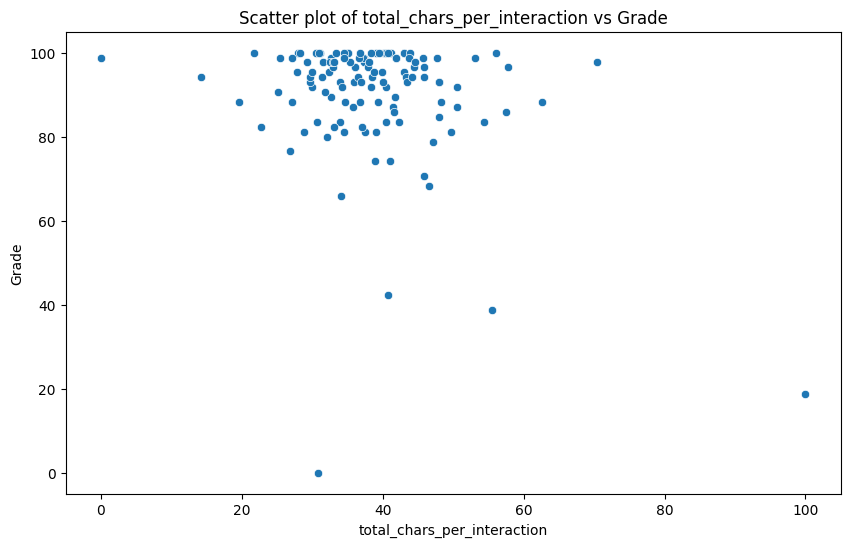

# CS412 Machine Learning Course Project
***
## Project Description

The project aims to predict homework scores using various machine learning models. The approach involves extracting and preprocessing data from conversations, employing feature engineering techniques to enrich the dataset, and then applying multiple regression models to predict the scores. This multidimensional analysis ensures a thorough understanding and effective prediction of homework scores based on the given data.

The work presented is for the CS412 Machine Learning course at Sabanci University.

## Table of Contents
1. [General Info](#general-info)
2. [Methodology](#methodology)
3. [Results](#results)
4. [Team Contributions](#teamcontributions)
### General Info
***

### Screenshot
<p align="center">
  
</p>

## Methodology
***
A list of metthodologies used within the project:
* Download Data (Links to Code Snippets?)
  
```ruby
require 'redcarpet'
markdown = Redcarpet.new("Hello World!")
puts markdown.to_html
```

* Create/Extract Features (Links to Code Snippets?)
* Select Features (Links to Code Snippets?)
* Different Modelts traines (NN, randomForest etc.) (Links to Code Snippets?)
## Results
***
Discussion adn conclusion
```
$ git clone https://example.com
$ cd ../path/to/the/file
$ npm install
$ npm start
```
## Team Contributions
***
Give instructions on how to collaborate with your project.
> Maybe you want to write a quote in this part. 
> Should it encompass several lines?
> This is how you do it.
